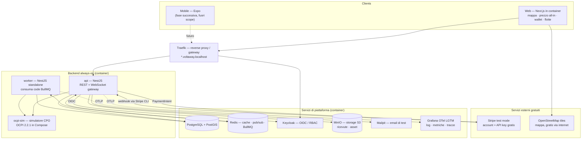
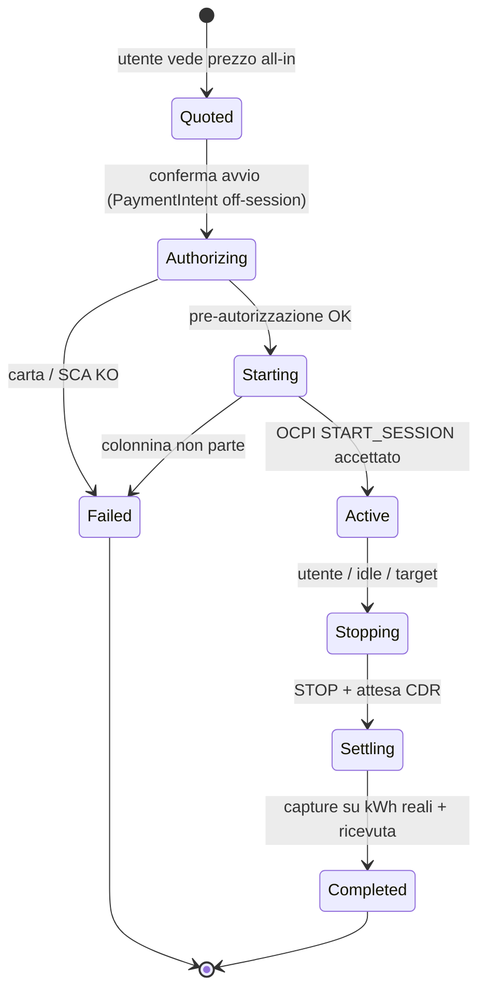
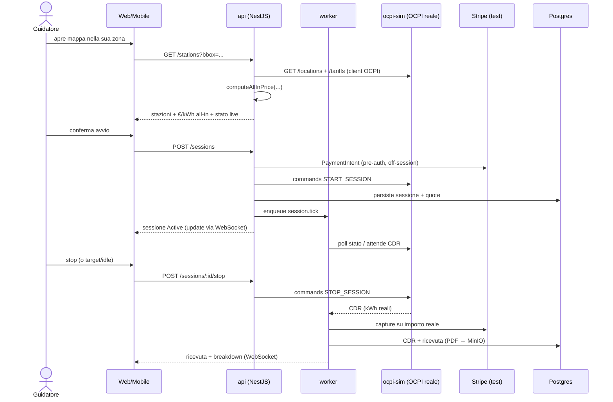

# Architettura — Voltaway

Architettura **production-grade** dell'eMSP Voltaway (vedi [`README.md`](./README.md)), eseguibile in locale via **Docker Compose**.

> **Fase attuale.** Il repository contiene documentazione, infrastruttura Docker e monorepo applicativo funzionante. `docker compose up -d --build` avvia lo stack completo: mappa con prezzo all-in, sessioni OCPI start/stop (senza pagamento), WebSocket, sync disponibilità via worker.
>
> **Gap rispetto al target.** Pagamenti Stripe, auth Keycloak nell'app, schema dati completo, ricevute MinIO e altro sono ancora da fare — vedi [`BACKLOG.md`](./BACKLOG.md). I diagrammi del codice attuale sono in [`CODEMAP.md`](./CODEMAP.md).
>
> **Obiettivo.** Lo stack è quello dell'app vera e propria: backend dedicato always-on, Postgres+PostGIS, Redis, code, realtime, IdP self-hosted, object storage, gateway. I servizi **nostri** girano in container; i **servizi esterni sono ammessi solo se gratuiti** (Stripe test mode, tile OpenStreetMap).
>
> **Integrazioni senza accordi:** `ocpi-sim` simula un CPO via **OCPI 2.2.1** in Compose; i pagamenti usano **Stripe test mode** (account e chiavi API gratuiti, nessun addebito reale). In produzione si cambiano URL/credenziali, non il codice.

---

## Indice

1. [Principi di progettazione](#1-principi-di-progettazione)
2. [Politica sviluppo locale](#2-politica-sviluppo-locale)
3. [Vista d'insieme](#3-vista-dinsieme)
4. [Stack tecnologico e razionale](#4-stack-tecnologico-e-razionale)
5. [Topologia Docker](#5-topologia-docker)
6. [Struttura del monorepo](#6-struttura-del-monorepo)
7. [Moduli di dominio](#7-moduli-di-dominio)
8. [Modello dati](#8-modello-dati)
9. [Flussi principali](#9-flussi-principali)
10. [Realtime](#10-realtime)
11. [Autenticazione e autorizzazione](#11-autenticazione-e-autorizzazione)
12. [Sicurezza, privacy e compliance](#12-sicurezza-privacy-e-compliance)
13. [Osservabilità e qualità](#13-osservabilità-e-qualità)
14. [Sviluppo locale](#14-sviluppo-locale)
15. [Variabili d'ambiente](#15-variabili-dambiente)
16. [Dalla locale alla produzione](#16-dalla-locale-alla-produzione)
17. [Rischi tecnici e mitigazioni](#17-rischi-tecnici-e-mitigazioni)

---

## 1. Principi di progettazione

1. **Voltaway è un livello software (eMSP), non un proprietario di asset.** Nessun hardware, nessuna energia. Il valore è *prezzo all-in trasparente* + *affidabilità live* + *prodotto flotte*.
2. **Backend dedicato always-on.** Il dominio (sessioni a lunga durata, realtime, integrazione OCPI server-side, code) vive in servizi persistenti, non in function effimere.
3. **Ports & adapters.** OCPI, pagamenti, storage, notifiche e auth sono interfacce nel dominio; le implementazioni (simulatore o reale) sono adapter intercambiabili. È ciò che rende il passaggio sim → reale un cambio di configurazione.
4. **Il prezzo è il prodotto.** Il *motore tariffario all-in* è un modulo puro, deterministico e testato: dato il listino CPO + le fee Voltaway → un singolo €/kWh onesto, mostrato **prima** dell'avvio.
5. **TypeScript end-to-end, tipi condivisi.** Un linguaggio per web, mobile, API e worker; il connettore OCPI ad alta concorrenza può passare a Go se/quando serve, dietro la stessa interfaccia.
6. **Parità dev/prod.** Gli stessi artefatti container girano in locale e in produzione: cambiano solo orchestratore e backing service gestiti.

## 2. Politica sviluppo locale

Vincoli espliciti per la demo locale (nessun accordo commerciale):

| Regola | Dettaglio |
|---|---|
| **Docker Compose** | Tutti i servizi **nostri** (`api`, `worker`, `web`, `ocpi-sim` + infra) girano in container |
| **Costo zero** | Nessun servizio a pagamento in locale |
| **Nessun accordo** | Niente CPO, hub OCPI, PSP reali — `ocpi-sim` (+ Stripe **test mode** quando implementato) |
| **Esterni ammessi** | Solo se **gratuiti** e senza contratto commerciale |
| **Mobile** | **Fuori scope attuale** — vedi [`BACKLOG.md`](./BACKLOG.md) |
| **Codice app** | **Demo E2E** — mappa, prezzi, sessioni OCPI, WS; pagamenti/auth in [`BACKLOG.md`](./BACKLOG.md) |

### Servizi esterni gratuiti (ammessi)

| Servizio | Uso | Costo | Note |
|---|---|---|---|
| **Stripe test mode** | tokenizzazione carta, PaymentIntent, SCA, webhook | Gratuito | Account Stripe gratis; chiavi `sk_test_` / `pk_test_`; webhook in locale via **Stripe CLI** (gratuita) sull'host |
| **OpenStreetMap tiles** | mappa MapLibre (`tile.openstreetmap.org`) | Gratuito | Richiede internet; rispettare la [usage policy OSM](https://operations.osmfoundation.org/policies/tiles/) |

### Servizi in container (nessun esterno)

Postgres+PostGIS, Redis, Keycloak, MinIO, Mailpit, Traefik, `ocpi-sim`, `api`, `worker`, `web`, Grafana OTel LGTM (profilo `obs`).

## 3. Vista d'insieme



L'**API** serve REST + WebSocket ai client; il **worker** esegue i processi asincroni e di lunga durata (orchestrazione sessioni, ingestione CDR, sync disponibilità, idle-fee) consumando code **BullMQ** su Redis; **`ocpi-sim`** è il CPO finto che parla OCPI reale. In produzione `ocpi-sim` viene sostituito dagli hub (Hubject/Gireve) e Stripe passa in live.

## 4. Stack tecnologico e razionale

| Area | Tecnologia | Perché |
|---|---|---|
| Linguaggio | **TypeScript** (strict) ovunque | tipi condivisi tra web/mobile/api/worker |
| Monorepo | **pnpm workspaces + Turborepo** | build/cache incrementale, dipendenze condivise |
| Web | **Next.js** (App Router) + React + Tailwind + shadcn/ui | landing, mappa pubblica "prezzo reale" (SEO), dashboard flotte |
| Mobile | **Expo / React Native** | *fase successiva* — fuori scope attuale; architettura predisposta in `packages/` |
| Mappa | **MapLibre GL** + tiles **OpenStreetMap** (esterno gratuito) | nessun costo; richiede internet |
| API | **NestJS** (REST + WebSocket gateway) | always-on, struttura chiara, DI, guardie OIDC |
| Worker | **NestJS standalone** + **BullMQ** | job a lunga durata e ricorrenti, retry/idempotenza |
| Connettore OCPI | client **OCPI 2.2.1** (TS; hot path estraibile in **Go**) | integrazione roaming reale, dietro interfaccia |
| Realtime | **WebSocket** (Socket.IO) + **Redis pub/sub** | stato live colonnine/sessioni multi-istanza |
| Database | **PostgreSQL 16 + PostGIS** | relazionale + query geospaziali "vicino a me"/corridoio |
| ORM/migrazioni | **Drizzle ORM** + drizzle-kit | type-safe, SQL-friendly per i tipi PostGIS |
| Cache/coda | **Redis 7** | cache disponibilità, pub/sub, broker BullMQ, rate-limit |
| Object storage | **MinIO** (S3-compatibile) | ricevute/asset; in prod → S3/GCS/R2 senza cambiare codice |
| Auth | **Keycloak** (OIDC/OAuth2, RBAC) | IdP self-hosted, realm/clients/ruoli, org flotte via gruppi |
| Pagamenti | **Stripe test mode** (account + API key gratuiti) | PaymentIntents + SCA; webhook via Stripe CLI |
| Gateway | **Traefik v3** | reverse proxy con service discovery via label, TLS in prod |
| Email | **Mailpit** (locale) | cattura email di conferma/ricevute |
| Validazione | **Zod** | *pianificato* — schema condiviso input API e form |
| Test | **Vitest** | ✅ oggi: motore prezzo (`packages/core`); *pianificato*: Playwright e2e, Testcontainers in CI |
| Qualità | **Prettier** + **TypeScript** (strict) | ✅ oggi: formattazione e type-check; *pianificato*: SonarQube in CI |
| Osservabilità | **OpenTelemetry** → **Grafana OTel LGTM** + **Sentry** | *pianificato* — stack LGTM in Compose (profilo `obs`), app non instrumentata |
| Esecuzione | **Docker + Docker Compose** | servizi nostri in container; esterni solo se gratuiti |

**Note di scelta**

- **NestJS** anziché serverless: una sessione di ricarica dura 20–60+ min ed è un processo stateful; servono endpoint OCPI server-side stabili, code, retry e connessioni realtime persistenti — la forma classica di un backend always-on.
- **Keycloak** anziché un IdP SaaS: gira in locale in Docker, è completo (RBAC, gruppi/org, MFA, OIDC standard) e non lega a un fornitore. Alternative valide self-hosted: Zitadel, Authentik, Logto.
- **Drizzle + PostGIS**: Drizzle è SQL-friendly e gestisce bene colonne `geometry`/`geography` (via tipi custom e SQL), evitando i limiti PostGIS di altri ORM.
- **`ocpi-sim` come servizio** anziché mock in-process: esercita il **vero** client OCPI (HTTP, token, moduli `locations`/`tariffs`/`sessions`/`cdrs`/`commands`), così il codice di produzione è già rodato.

## 5. Topologia Docker

Definita in [`docker-compose.yml`](./docker-compose.yml). Uso dei **profili** per tenere snella la base:

- **default** (infra) — parte subito, anche senza il codice app: `postgres`, `redis`, `keycloak`, `minio`, `mailpit`, `traefik`.
- **`app`** — i servizi applicativi (richiedono lo scaffold del codice): `api`, `worker`, `web`, `ocpi-sim`.
- **`obs`** — osservabilità: `observability` (Grafana OTel LGTM all-in-one).

| Servizio | Immagine / build | Porta (host) | Host Traefik | Profilo |
|---|---|---|---|---|
| `traefik` | `traefik:v3` | 80, 8080 (dashboard) | — | default |
| `postgres` | `postgis/postgis:16-3.4` | 5432 | — | default |
| `redis` | `redis:7-alpine` | 6379 | — | default |
| `keycloak` | `quay.io/keycloak/keycloak:26.0` | — | `auth.voltaway.localhost` | default |
| `minio` | `minio/minio` | 9000, 9001 (console) | `minio.voltaway.localhost` | default |
| `mailpit` | `axllent/mailpit` | 8025 (web), 1025 (smtp) | `mail.voltaway.localhost` | default |
| `ocpi-sim` | build `apps/ocpi-sim` | — | `ocpi.voltaway.localhost` | app |
| `api` | build `apps/api` | — | `api.voltaway.localhost` | app |
| `worker` | build `apps/worker` | — | — | app |
| `web` | build `apps/web` | — | `app.voltaway.localhost` | app |
| `observability` | `grafana/otel-lgtm` | 3000 (Grafana), 4317/4318 (OTLP) | `grafana.voltaway.localhost` | obs |

I domini `*.voltaway.localhost` risolvono a `127.0.0.1` nei browser moderni (vedi [§14](#14-sviluppo-locale)).

## 6. Struttura del monorepo

Struttura attuale del repository (pacchetti opzionali `api-client`/`ui` in backlog — vedi [`BACKLOG.md`](./BACKLOG.md)).

```text
voltaway/
├── apps/
│   ├── web/                  # Next.js: landing, mappa, app, dashboard flotte
│   ├── mobile/               # Expo / React Native (fase successiva, fuori scope)
│   ├── api/                  # NestJS: REST + WebSocket gateway
│   │   └── Dockerfile
│   ├── worker/               # NestJS standalone: consumer BullMQ
│   │   └── Dockerfile
│   └── ocpi-sim/             # Simulatore CPO OCPI 2.2.1
│       └── Dockerfile
├── packages/
│   ├── core/                 # dominio puro: tariffe, sessioni, regole, tipi (no infra)
│   ├── ocpi/                 # tipi OCPI 2.2.1 + interfaccia + client (sim/reale)
│   ├── db/                   # schema Drizzle + client + migrazioni
│   ├── api-client/           # client tipizzato condiviso web/mobile
│   ├── ui/                   # componenti condivisi (shadcn/ui)
│   └── config/               # preset eslint/tsconfig/tailwind
├── infra/
│   ├── keycloak/realm/       # import realm (clients, ruoli)
│   ├── traefik/              # config dinamica opzionale
│   └── postgres/             # init/seed opzionali
├── docker-compose.yml
├── .env.example
├── .dockerignore
├── ARCHITECTURE.md
└── README.md
```

## 7. Moduli di dominio

> Le sezioni 7–9 descrivono l'**architettura target**. Per cosa è già nel codice vs cosa manca, vedi [`BACKLOG.md`](./BACKLOG.md) e [`CODEMAP.md`](./CODEMAP.md).

### 7.1 OCPI

`packages/ocpi` definisce l'interfaccia usata da API e worker, indipendente da cosa c'è dietro.

```typescript
// packages/ocpi/src/provider.ts
export interface OcpiProvider {
  getLocations(area: BoundingBox): Promise<Location[]>;   // locations
  getTariff(tariffId: string): Promise<CpoTariff>;        // tariffs
  getStatus(evseIds: string[]): Promise<EvseStatus[]>;    // disponibilità live
  startSession(input: StartSessionInput): Promise<SessionRef>; // commands START_SESSION
  stopSession(ref: SessionRef): Promise<void>;            // commands STOP_SESSION
  getCdr(ref: SessionRef): Promise<Cdr>;                  // cdrs
}
```

- **Locale:** `ocpi-sim` è un servizio HTTP che implementa gli **endpoint CPO OCPI 2.2.1** con dati seed (location reali del beachhead, tariffe eterogenee plausibili, transizioni di stato simulate, CDR coerenti). Il client OCPI dell'app ci parla **come parlerebbe a un hub reale**.
- **Produzione:** stesso client, `OCPI_BASE_URL`/`OCPI_TOKEN` puntati a Hubject/Gireve. Nessun consumatore cambia.

```typescript
// composition root (api / worker)
const ocpi = new OcpiClient({
  baseUrl: env.OCPI_BASE_URL,   // http://ocpi-sim:4000  |  https://hub.reale/ocpi
  token: env.OCPI_TOKEN,
});
```

### 7.2 Motore tariffario all-in

Funzione **pura** e deterministica — il modulo più testato del sistema.

```typescript
// packages/core/src/pricing/allInPrice.ts
export function computeAllInPrice(input: {
  cpoTariff: CpoTariff;     // energia, tempo, sosta, fee sessione del CPO
  voltawayFee: FeePolicy;   // markup % o fee fissa, sconto premium
  estimate: { kWh: number; minutes: number };
}): AllInQuote;             // €/kWh all-in + breakdown trasparente
```

Garanzia: lo **scostamento tra prezzo mostrato e addebitato deve tendere a 0** (KPI di fiducia). Breakdown sempre disponibile alla UI.

### 7.3 Orchestratore sessioni (worker + macchina a stati)

L'avvio arriva dall'API; il **worker** porta avanti la sessione tramite job BullMQ e ne aggiorna lo stato, emettendo eventi realtime.



Job tipici: `session.tick` (polling/aggiornamento), `cdr.ingest`, `availability.sync`, `idle.detect`. Idempotenti, con retry e backoff.

### 7.4 Disponibilità e affidabilità

- Stato da `OcpiProvider.getStatus` (da `ocpi-sim` in locale), **snapshot** in Redis per la mappa a bassa latenza, rinfrescati da un job ricorrente.
- Layer **affidabilità community**: segnalazioni utente persistite in Postgres e fuse nello scoring colonnina — differenziatore chiave.

### 7.5 Pagamenti

- **Stripe**: `SetupIntent` per tokenizzare, `PaymentIntent` off-session per pre-autorizzare all'avvio, **capture sull'importo reale** a CDR ricevuto, ricevuta unica (PDF in MinIO).
- **SCA/3DS** gestiti da Stripe; Voltaway **non tocca mai i dati carta** (PCI scope minimo, SAQ A).
- **Webhook** verificati per firma e idempotenti (endpoint `POST /webhooks/stripe`). In locale i webhook arrivano via **Stripe CLI** (`stripe listen`).

### 7.6 Wallet flotte (B2B)

- `Fleet` con più `Driver`, regole di spesa, **fatturazione unica mensile** + export contabilità, split privato/aziendale per sessione.
- RBAC: `fleet_admin` gestisce conducenti/policy; `driver` ricarica entro le regole.

## 8. Modello dati

PostgreSQL + PostGIS (Drizzle). Tabelle principali:

| Tabella | Scopo | Note |
|---|---|---|
| `users` | guidatori e admin | mappati su Keycloak (`oidc_sub`) |
| `vehicles` | auto dell'utente | connettore, capacità, curva di ricarica |
| `payment_methods` | carte tokenizzate | solo riferimenti Stripe, **nessun PAN** |
| `cpos` | operatori (anagrafica) | provenienza OCPI |
| `stations` | siti fisici | `geom geography(Point,4326)` (PostGIS) |
| `evses` | punti di ricarica | potenza, connettori, `status` live |
| `tariffs` | listini CPO grezzi | input del motore all-in |
| `price_quotes` | preventivi mostrati | per misurare scostamento mostrato/addebitato |
| `sessions` | sessioni di ricarica | stato (§7.3), ref OCPI/Stripe |
| `cdrs` | charge detail record | kWh, durata, costo finale |
| `reliability_reports` | segnalazioni community | feed scoring affidabilità |
| `fleets` | flotte B2B | regole spesa, fatturazione |
| `fleet_members` | conducente ↔ flotta | ruolo, limiti |
| `invoices` | fatture/ricevute | consumer e flotte |

Indici: **GiST** su `stations.geom` (query "vicino a me"), btree su `evses.status` e `stations.cpo_id`. Migrazioni Drizzle versionate in `packages/db`, applicate da un job di migrazione all'avvio (`migrate` step) — mai DDL a mano in produzione.

## 9. Flussi principali

### 9.1 Trova → prezzo → ricarica → paga



### 9.2 Job ricorrenti (worker)

- `availability.sync` — rinfresca lo stato colonnine in Redis.
- `idle.detect` — auto carica/idle → avvisi anti-penale, chiusura sessioni orfane.
- `invoice.monthly` — fatturazione flotte.

## 10. Realtime

- **Gateway WebSocket** nell'`api` (Socket.IO). I client si iscrivono a `session:{id}` e `area:{geohash}`.
- **Redis pub/sub** come backplane: il `worker` pubblica gli aggiornamenti, ogni istanza `api` li inoltra ai propri client → scala in orizzontale.
- Fallback SSE/polling per reti ostili.

## 11. Autenticazione e autorizzazione

- **Keycloak**, realm `voltaway` importato da `infra/keycloak/realm/` all'avvio:
  - client **`voltaway-web`** (public, Authorization Code + PKCE) per web/mobile,
  - client **`voltaway-api`** (confidential, service account) per scambi server-to-server,
  - ruoli realm: `driver`, `fleet_admin`, `admin`; le flotte come **gruppi**.
- L'`api` valida i **JWT OIDC** (discovery sull'issuer Keycloak) tramite guardie NestJS; l'autorizzazione è per ruolo/gruppo.
- I ruoli sono **server-controllati** (Keycloak); l'utente non se li auto-assegna.

## 12. Sicurezza, privacy e compliance

- **Dati carta**: mai sui server Voltaway — tokenizzazione/SCA via Stripe (PCI SAQ A).
- **Segreti**: in `.env` per il locale; in produzione tramite secret manager dell'orchestratore. Mai in repo.
- **GDPR**: minimizzazione (si conserva ciò che serve a sessione/fatturazione), export/cancellazione previsti; geolocalizzazione usata solo per la ricerca colonnine.
- **AFIR / trasparenza prezzo**: €/kWh all-in mostrato **prima** dell'avvio — requisito regolatorio oltre che posizionamento.
- **Hardening**: header di sicurezza al gateway, rate-limit (Redis), validazione Zod su ogni input *(pianificato)*, webhook firmati e idempotenti.

## 13. Osservabilità e qualità

### Oggi (nel repo)

| Area | Stato | Dettaglio |
|---|---|---|
| Formattazione | ✅ | Prettier (`pnpm format` / `format:check` in CI) |
| Tipi | ✅ | TypeScript strict; `lint` = `tsc --noEmit` (api, worker, packages); `next lint` su web |
| Test unitari | ✅ | Vitest su `packages/core` (motore all-in); `pnpm test` in CI |
| CI | ✅ | GitHub Actions: `format:check` → `build` → `test` (`.github/workflows/ci.yml`) |

### Pianificato (vedi [`BACKLOG.md`](./BACKLOG.md))

| Area | Dettaglio |
|---|---|
| **Test e2e** | Playwright sul flusso mappa → prezzo → avvio → ricevuta |
| **Test integrazione** | Testcontainers (Postgres/Redis reali) in CI |
| **Validazione** | Zod su ogni input API |
| **Analisi statica** | SonarQube in CI |
| **Tracing / metriche** | OpenTelemetry in `api`/`worker` → Grafana OTel LGTM (profilo Compose `obs`) |
| **Errori applicativi** | Sentry |
| **KPI tecnici** | Dashboard Grafana: tasso avvio riuscito, scostamento prezzo, % stato live corretto |

> Non sono previsti git hooks pre-commit (es. Husky): la qualità passa da CI e comandi `pnpm` espliciti.

## 14. Sviluppo locale

**Prerequisiti:** **Docker** + **Docker Compose v2**. Per sviluppo senza rebuild container: **Node.js 22 LTS**, **pnpm**.

Account **Stripe** gratuito (chiavi test) e **Stripe CLI** serviranno quando saranno implementati pagamenti e webhook — vedi [`BACKLOG.md`](./BACKLOG.md).

```bash
# 0. variabili d'ambiente
cp .env.example .env
#    Compila STRIPE_* quando svilupperai l'app (account Stripe gratuito → Developers → API keys test)

# 1. stack completo (infra + app)
docker compose up -d --build                 # postgres, redis, keycloak, minio, mailpit, traefik, api, worker, web, ocpi-sim

# 2. osservabilità (opzionale)
docker compose --profile obs up -d         # Grafana OTel LGTM

# 4. webhook Stripe (quando implementato) — Stripe CLI sull'host, gratuita
stripe listen --forward-to http://api.voltaway.localhost/webhooks/stripe
```

- **Migrazioni/seed:** `pnpm db:migrate` e `pnpm db:seed` (eseguiti anche all'avvio API in Docker).
- **Mobile**: fuori scope attuale; si definirà in seguito.
- **Mappa**: tile da OpenStreetMap (gratuite, via internet) — vedi [§2](#2-politica-sviluppo-locale).

## 15. Variabili d'ambiente

Riferimento completo in [`.env.example`](./.env.example). Sintesi:

| Variabile | Scopo |
|---|---|
| `POSTGRES_USER` / `POSTGRES_PASSWORD` / `POSTGRES_DB` | credenziali Postgres |
| `DATABASE_URL` | stringa di connessione per api/worker |
| `REDIS_URL` | cache/coda/pub-sub |
| `OIDC_ISSUER_URL` | issuer Keycloak (es. `http://keycloak:8080/realms/voltaway`) |
| `KEYCLOAK_*` | admin bootstrap + client id/secret |
| `OCPI_MODE` / `OCPI_BASE_URL` / `OCPI_TOKEN` | `sim` → `ocpi-sim`; `live` → hub reale |
| `STRIPE_SECRET_KEY` / `STRIPE_WEBHOOK_SECRET` / `NEXT_PUBLIC_STRIPE_PUBLISHABLE_KEY` | pagamenti (chiavi **test** in locale) |
| `S3_ENDPOINT` / `S3_BUCKET` / `MINIO_ROOT_USER` / `MINIO_ROOT_PASSWORD` | object storage |
| `SMTP_HOST` / `SMTP_PORT` | email (Mailpit in locale) |
| `OTEL_EXPORTER_OTLP_ENDPOINT` | osservabilità |
| `NEXT_PUBLIC_API_URL` / `NEXT_PUBLIC_MAP_TILES_URL` | front-end |

I segreti reali non stanno nel repo: in locale in `.env` (git-ignored), in produzione nel secret manager.

## 16. Dalla locale alla produzione

Gli **stessi container** si promuovono; cambiano orchestrazione e backing service.

| Capacità | Locale (Docker Compose) | Produzione |
|---|---|---|
| Orchestrazione | Docker Compose | Kubernetes / ECS / Nomad / Swarm |
| Integrazione ricarica | `ocpi-sim` (OCPI 2.2.1) | Hubject / Gireve (stesso client) |
| Pagamenti | Stripe test + Stripe CLI | Stripe live (+ eventuale Adyen a scala) |
| Database | container PostGIS | Postgres gestito + PostGIS (RDS/Cloud SQL/Neon) |
| Cache/coda | container Redis | Redis gestito (ElastiCache/Upstash) |
| Object storage | MinIO | S3 / GCS / R2 (stessa API S3) |
| Auth | Keycloak container | Keycloak HA (o IdP gestito) |
| Realtime | WS + Redis pub/sub | idem, multi-istanza dietro LB |
| Gateway/TLS | Traefik (HTTP) | Traefik/Ingress con TLS automatico |
| Connettore OCPI hot path | TS | eventuale microservizio **Go** dietro la stessa interfaccia |

Front-end e dominio **non cambiano**: cambiano gli adapter e dove gira l'orchestrazione.

## 17. Rischi tecnici e mitigazioni

| Rischio | Mitigazione |
|---|---|
| Eterogeneità reale delle tariffe CPO vs simulatore | motore all-in con suite di test estendibile; `ocpi-sim` modella già energia/tempo/sosta/fee e casi limite |
| Scostamento prezzo mostrato vs addebitato | `price_quotes` persistiti e confrontati col CDR; capture sull'importo reale; KPI monitorato |
| Sessioni long-running e fallimenti parziali | macchina a stati + job idempotenti con retry/backoff; riconciliazione via CDR |
| Realtime a scala | Redis pub/sub come backplane; istanze `api` stateless |
| Affidabilità dati colonnine | fusione stato OCPI + segnalazioni community; densità geografica prima dell'ampiezza |
| Lock-in infrastrutturale | standard aperti (OCPI, OIDC, S3, Postgres) + ports & adapters; container portabili |
| Onere operativo locale (molti servizi) | profili Compose (`app`/`obs`) per avviare solo il necessario; healthcheck e `depends_on` |
