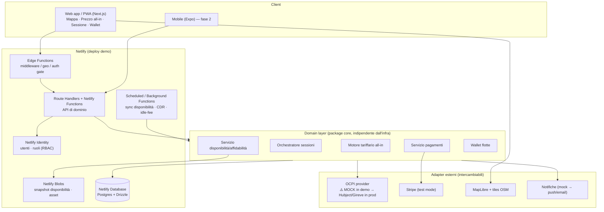
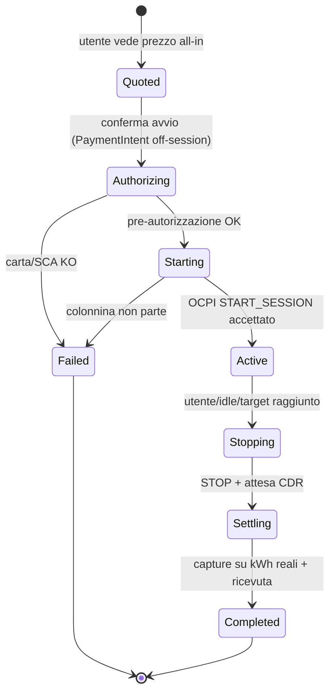
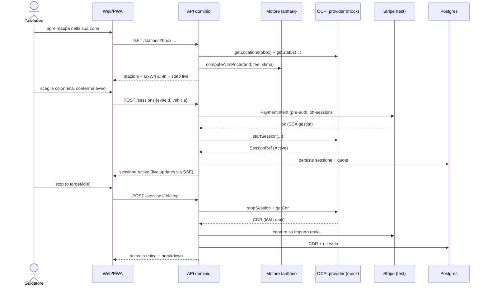

# Architettura — Voltaway

Documento di architettura per la **base iniziale completa ma demo** di Voltaway, l'eMSP per la ricarica EV descritto nel [`README.md`](./README.md).

> **Filosofia: "completo ma demo".**
> L'architettura, i confini dei moduli e il modello dati sono quelli **reali e di produzione**. Ciò che è "demo" è l'**esecuzione**: poiché non esistono ancora accordi commerciali con CPO, hub OCPI o PSP, ogni integrazione esterna è **simulata dietro un'interfaccia**. Passare dalla demo alla produzione significa **sostituire un'implementazione**, non riscrivere l'app.

---

## Indice

1. [Principi di progettazione](#1-principi-di-progettazione)
2. [Vista d'insieme](#2-vista-dinsieme)
3. [Stack tecnologico e razionale](#3-stack-tecnologico-e-razionale)
4. [Struttura del monorepo](#4-struttura-del-monorepo)
5. [Moduli di dominio](#5-moduli-di-dominio)
6. [Modello dati](#6-modello-dati)
7. [Flussi principali](#7-flussi-principali)
8. [Dati demo e seeding](#8-dati-demo-e-seeding)
9. [Sicurezza, privacy e compliance](#9-sicurezza-privacy-e-compliance)
10. [Osservabilità e qualità](#10-osservabilità-e-qualità)
11. [Ambienti, CI/CD e deploy](#11-ambienti-cicd-e-deploy)
12. [Variabili d'ambiente](#12-variabili-dambiente)
13. [Evoluzione demo → produzione](#13-evoluzione-demo--produzione)
14. [Rischi tecnici e mitigazioni](#14-rischi-tecnici-e-mitigazioni)

---

## 1. Principi di progettazione

1. **Voltaway è un livello software (eMSP), non un proprietario di asset.** Nessun hardware, nessuna energia. Il valore è il *prezzo all-in trasparente* + *affidabilità live* + *prodotto flotte*.
2. **Integrazioni esterne dietro porte/interfacce (ports & adapters).** OCPI, pagamenti, mappe e notifiche sono definiti come interfacce nel dominio; le implementazioni (mock o reali) sono adapter intercambiabili. È il cuore del «completo ma demo».
3. **Il prezzo è il prodotto.** Il *motore tariffario all-in* è un modulo puro, testato e deterministico: dato il listino di un CPO + le fee Voltaway → un singolo €/kWh onesto, mostrato **prima** dell'avvio.
4. **TypeScript end-to-end, tipi condivisi.** Un solo linguaggio per web, mobile, backend e contratti API riduce attrito e bug per un team piccolo.
5. **Demo deployabile davvero.** Gira su Netlify con dati seed: niente "finto statico", ma un'app end-to-end (mappa → prezzo → avvio → pagamento test → ricevuta).
6. **Confini pronti per la scala.** Dove il serverless non regge i workload di produzione (orchestrazione sessioni a lunga durata, realtime, polling massivo OCPI), i confini sono già tracciati per estrarre un servizio dedicato senza toccare il front-end.

## 2. Vista d'insieme



**Lettura rapida:** il client parla con un'**API di dominio**; il dominio è un package puro che dipende solo da **interfacce**; gli **adapter** (OCPI, Stripe, mappe, notifiche) sono iniettati. In demo gli adapter sono mock/test; in produzione si scambiano con le implementazioni reali.

## 3. Stack tecnologico e razionale

### 3.1 Scelte

| Area | Tecnologia | Versione/nota |
|---|---|---|
| Linguaggio | TypeScript (strict) | tipi condivisi via package `core` |
| Monorepo | npm/pnpm workspaces + Turborepo | build/cache incrementale |
| Web | Next.js (App Router) | runtime `@netlify/next` (auto) |
| UI | React + Tailwind CSS + shadcn/ui | design system rapido e accessibile |
| Mappa | MapLibre GL JS + tiles OpenStreetMap | nessun vendor lock-in, zero accordi |
| Stato client | TanStack Query + Zustand | server-state + UI-state |
| Mobile (fase 2) | Expo / React Native | riusa `core` e `api-client` |
| API | Next.js Route Handlers + Netlify Functions | endpoint standalone per webhook/cron |
| Validazione | Zod | un solo schema per input API e form |
| Database | Netlify Database (Postgres) | gestito, branch per preview |
| ORM/migrazioni | Drizzle ORM `@beta` + Drizzle Kit `@beta` | migrazioni in `netlify/database/migrations` |
| Geo | PostGIS se disponibile, altrimenti bounding-box + haversine | query "vicino a me" |
| Cache/asset | Netlify Blobs | snapshot disponibilità, ricevute, asset |
| Realtime (demo) | SSE + polling | stato colonnina/sessione |
| Pagamenti | Stripe (test mode), PaymentIntents + SCA | tokenizzazione, off-session capture |
| Auth | Netlify Identity (`@netlify/identity`) | RBAC: `driver`, `fleet_admin`, `admin` |
| Integrazione ricarica | OCPI 2.2.1 — adapter | **mock in demo** |
| Test | Vitest (unit/integration) + Playwright (e2e) | gate prezzo deterministico |
| Qualità | ESLint + Prettier + TypeScript + SonarQube | + Husky/lint-staged |
| Osservabilità | Sentry (errori) + log Netlify + Grafana (metriche) | dashboard KPI tecnici |
| CI/CD | GitHub Actions + Netlify Git deploys | preview per PR, prod su `main` |

### 3.2 Perché questo stack

- **Netlify come piattaforma di deploy** (vincolo di progetto): Next.js è auto-rilevato e il runtime converte SSR/route/middleware in Functions ed Edge Functions; **Netlify Database** dà Postgres gestito con *branch per ogni deploy preview* (perfetto per testare migrazioni e dati senza toccare la produzione); **Blobs** copre asset e cache binarie; **Identity** copre auth/RBAC. Meno infrastruttura da gestire = più velocità per un team piccolo.
- **TypeScript ovunque + monorepo**: il *motore tariffario* e i *tipi OCPI* vivono in un package condiviso e sono riusati identici da web, mobile e funzioni. Un bug sul prezzo si corregge in un punto solo.
- **MapLibre + OSM**: la mappa "prezzo reale" è l'amo SEO e la demo pubblica; nessun accordo o chiave vendor per partire.
- **Stripe test mode**: flusso pagamento realistico (SCA, tokenizzazione, addebito a fine sessione) senza contratto PSP.
- **Ports & adapters su OCPI**: è la decisione architetturale che rende vera la promessa "completo ma demo".

> **Onestà ingegneristica.** Il serverless puro non è l'ambiente ideale per orchestrazione di sessioni a lunga durata, connessioni realtime persistenti e polling OCPI ad alto volume. Per la **demo** va benissimo (job schedulati + SSE + dati seed). Per la **produzione** questi workload migrano in un servizio dedicato — vedi [§13](#13-evoluzione-demo--produzione). I confini sono già disegnati per quel salto.

## 4. Struttura del monorepo

Struttura **target** (lo scaffold del codice è il passo successivo; il repository attuale contiene documentazione e configurazione).

```text
voltaway/
├── apps/
│   ├── web/                  # Next.js (App Router): landing, mappa, app, dashboard flotte
│   │   ├── app/
│   │   │   ├── (public)/     # landing + mappa prezzo pubblica (SEO)
│   │   │   ├── (app)/        # area autenticata: sessioni, wallet, storico
│   │   │   ├── (fleet)/      # dashboard flotte
│   │   │   └── api/          # Route Handlers (BFF)
│   │   └── ...
│   └── mobile/               # Expo / React Native (fase 2)
├── packages/
│   ├── core/                 # dominio puro: tariffe, sessioni, tipi, regole (no infra)
│   ├── ocpi/                 # tipi OCPI 2.2.1 + interfaccia provider + MockOcpiProvider
│   ├── db/                   # schema Drizzle + client + query
│   ├── api-client/           # client tipizzato condiviso web/mobile
│   ├── ui/                   # componenti condivisi (shadcn/ui)
│   └── config/               # eslint/tsconfig/tailwind preset condivisi
├── netlify/
│   ├── functions/            # endpoint standalone (webhook Stripe, ecc.)
│   │   ├── _shared/          # codice condiviso non-funzione
│   │   ├── stripe-webhook.mts
│   │   ├── ocpi-sync-availability-background.mts
│   │   └── close-idle-sessions.mts        # scheduled
│   └── database/
│       └── migrations/       # migrazioni applicate dal deploy
├── drizzle.config.ts
├── netlify.toml
├── .env.example
├── ARCHITECTURE.md
└── README.md
```

## 5. Moduli di dominio

### 5.1 OCPI connector (mock → reale)

Il modulo `packages/ocpi` definisce l'**interfaccia** che il resto dell'app usa, indipendente dal fatto che dietro ci sia un mock o un hub reale.

```typescript
// packages/ocpi/src/provider.ts
export interface OcpiProvider {
  /** Location + EVSE + connettori in un bounding box geografico. */
  getLocations(area: BoundingBox): Promise<Location[]>;
  /** Listino tariffario grezzo del CPO per una tariffa referenziata. */
  getTariff(tariffId: string): Promise<CpoTariff>;
  /** Stato live (disponibile/occupato/guasto) di uno o più EVSE. */
  getStatus(evseIds: string[]): Promise<EvseStatus[]>;
  /** Avvio remoto sessione (OCPI commands: START_SESSION). */
  startSession(input: StartSessionInput): Promise<SessionRef>;
  /** Stop remoto sessione (STOP_SESSION). */
  stopSession(sessionRef: SessionRef): Promise<void>;
  /** Charge Detail Record finale (kWh, durata, costo CPO). */
  getCdr(sessionRef: SessionRef): Promise<Cdr>;
}
```

- **Demo:** `MockOcpiProvider` implementa l'interfaccia con dati seed deterministici (location reali del beachhead, tariffe eterogenee plausibili, transizioni di stato simulate, CDR coerenti con la sessione). Un job schedulato fa "fluttuare" disponibilità e potenza erogata per realismo.
- **Produzione:** `HubjectOcpiProvider` / `GireveOcpiProvider` parlano OCPI 2.2.1 reale (token, moduli `locations`, `tariffs`, `sessions`, `cdrs`, `commands`). **Nessun consumatore del dominio cambia.**

La selezione avviene per configurazione:

```typescript
// composition root
const ocpi: OcpiProvider =
  env.OCPI_MODE === "live"
    ? new HubjectOcpiProvider({ token: env.OCPI_TOKEN! })
    : new MockOcpiProvider({ seed: "beachhead-it" });
```

### 5.2 Motore tariffario all-in

Funzione **pura** e deterministica: è il cuore del valore percepito e il modulo più testato del sistema.

```typescript
// packages/core/src/pricing/allInPrice.ts
export function computeAllInPrice(input: {
  cpoTariff: CpoTariff;     // energia, tempo, sosta, fee sessione del CPO
  voltawayFee: FeePolicy;   // markup % o fee fissa, sconto premium
  estimate: { kWh: number; minutes: number };
}): AllInQuote {
  // → €/kWh equivalente all-in + breakdown trasparente (energia, fee CPO, fee Voltaway, sosta attesa)
}
```

Garanzie: lo **scostamento tra prezzo mostrato e addebitato deve tendere a 0** (KPI di fiducia). Il breakdown è sempre disponibile per la UI ("perché pago questo").

### 5.3 Orchestratore sessioni

Macchina a stati che governa il ciclo di vita della ricarica.



In demo le transizioni sono guidate dal `MockOcpiProvider` (start "riuscito", erogazione simulata, CDR a fine sessione). In produzione sono guidate dagli eventi OCPI reali. Per la lunga durata: in demo si usano funzioni schedulate/background; in produzione un servizio dedicato (vedi §13).

### 5.4 Servizio disponibilità e affidabilità

- Fonte stato: `OcpiProvider.getStatus` (mock in demo).
- **Snapshot** periodici salvati su **Netlify Blobs** (letti dalla mappa con bassa latenza), aggiornati da una **Scheduled/Background Function**.
- Layer **affidabilità community**: segnalazioni utente ("non partiva", "potenza bassa") persistite in Postgres e fuse nello scoring colonnina — è uno dei differenziatori chiave.

### 5.5 Servizio pagamenti

- **Stripe** (test mode in demo): `SetupIntent` per tokenizzare la carta, `PaymentIntent` off-session per pre-autorizzazione all'avvio, **capture sull'importo reale** a CDR ricevuto, ricevuta unica.
- **SCA / 3DS** gestiti dal flusso Stripe. Voltaway **non tocca mai i dati carta** (PCI scope minimo).
- Webhook Stripe gestito da una Netlify Function dedicata (`netlify/functions/stripe-webhook.mts`) con verifica firma.

### 5.6 Wallet flotte (B2B)

- Entità `Fleet` con più `Driver`, regole di spesa, e **fatturazione unica mensile** con export contabilità.
- Split uso privato/aziendale per sessione.
- RBAC: `fleet_admin` gestisce conducenti e regole; `driver` ricarica entro le policy.

## 6. Modello dati

Schema relazionale in Postgres (Drizzle). Tabelle principali:

| Tabella | Scopo | Note chiave |
|---|---|---|
| `users` | Guidatori e admin | legati a Netlify Identity (`identity_sub`) |
| `vehicles` | Auto dell'utente | connettore, capacità, curva di ricarica |
| `payment_methods` | Carte tokenizzate | solo riferimenti Stripe, **nessun PAN** |
| `cpos` | Operatori (anagrafica) | provenienza OCPI / mock |
| `stations` | Stazioni (sito fisico) | `lat`/`lng` (+ geom PostGIS se disponibile) |
| `evses` | Punti di ricarica | potenza, connettori, `status` live |
| `tariffs` | Listini CPO grezzi | input del motore all-in |
| `price_quotes` | Preventivi all-in mostrati | per misurare scostamento mostrato/addebitato |
| `sessions` | Sessioni di ricarica | stato (vedi §5.3), riferimenti OCPI/Stripe |
| `cdrs` | Charge Detail Record | kWh, durata, costo finale |
| `reliability_reports` | Segnalazioni community | feed scoring affidabilità |
| `fleets` | Flotte B2B | regole spesa, fatturazione |
| `fleet_members` | Appartenenza conducente↔flotta | ruolo, limiti |
| `invoices` | Fatture/ricevute | consumer e flotte |

Indici geospaziali per le query "vicino a me" e indici su `evses.status`/`stations.cpo_id` per la mappa. Le migrazioni vivono in `netlify/database/migrations/` e sono **applicate dal deploy** (mai a mano sul DB hosted).

## 7. Flussi principali

### 7.1 Trova → prezzo → ricarica → paga (happy path)



### 7.2 Job di background (demo)

- `ocpi-sync-availability-background` — aggiorna gli snapshot di disponibilità su Blobs.
- `close-idle-sessions` (scheduled) — rileva auto carica/idle, applica avvisi anti-penale e chiude sessioni orfane.

## 8. Dati demo e seeding

- **Seed deterministico** del beachhead (es. una città italiana ad alta densità): CPO plausibili, stazioni georeferenziate reali (da dataset aperti), listini eterogenei pensati per mostrare il valore del prezzo all-in (energia vs tempo vs sosta vs fee sessione).
- **Simulatore di stato**: il mock fa variare disponibilità e potenza nel tempo per rendere viva la mappa.
- **Account demo**: un guidatore consumer + un `fleet_admin` con qualche conducente, così la dashboard flotte ha dati reali da mostrare.
- Tutto il seed è codice/versione-controllato e riproducibile.

## 9. Sicurezza, privacy e compliance

- **Dati carta**: mai sui server Voltaway. Tokenizzazione e SCA via Stripe → scope PCI minimo (SAQ A).
- **Segreti**: in variabili d'ambiente Netlify (UI/CLI), **mai** in `netlify.toml` o nel repo. Nelle Functions si usa `Netlify.env.get(...)`.
- **Auth/RBAC**: Netlify Identity con ruoli server-controllati in `app_metadata.roles` (`driver`, `fleet_admin`, `admin`); gli utenti non possono auto-assegnarsi ruoli.
- **GDPR**: minimizzazione (si conserva ciò che serve a sessione/fatturazione), diritto all'export/cancellazione previsto nel modello; geolocalizzazione usata solo per la ricerca colonnine.
- **AFIR / trasparenza prezzo**: il motore all-in mostra €/kWh comprensivo prima dell'avvio — allineato all'obbligo regolatorio, oltre che al posizionamento di prodotto.
- **Webhook**: verifica firma Stripe; idempotenza sugli eventi.

## 10. Osservabilità e qualità

- **Errori**: Sentry su web e funzioni.
- **Metriche/KPI tecnici**: log Netlify + dashboard Grafana per i KPI del README (tasso avvio riuscito, scostamento prezzo, % stato live corretto).
- **Qualità del codice**: ESLint + Prettier + TypeScript strict, **SonarQube** in CI per smell/coverage/duplicazioni.
- **Test**:
  - *Unit*: motore tariffario (tabelle di casi: scostamento atteso 0), macchina a stati sessione.
  - *Integration*: API ↔ `MockOcpiProvider` ↔ DB.
  - *E2E* (Playwright): flusso mappa → prezzo → avvio → ricevuta.
- **Gate di prodotto** (dal piano di validazione): tasso di avvio simulato ≥90% e prezzo mostrato == addebitato sui casi seed.

## 11. Ambienti, CI/CD e deploy

- **Deploy**: Git-based su Netlify. Ogni PR genera un **Deploy Preview** con il **proprio branch di database** forkato dalla produzione: migrazioni e dati di test non toccano la produzione.
- **Migrazioni**: si committano i file in `netlify/database/migrations/`; **le applica il deploy** (preview prima, produzione alla pubblicazione). In locale si usa `netlify database migrations apply`. Mai `drizzle-kit push`/`migrate` su DB hosted.
- **CI (GitHub Actions)**: typecheck, lint, test, SonarQube. Build verificata dal deploy Netlify.
- **Config**: `netlify.toml` (build, redirect, headers, funzioni). Vedi file in repo.
- **Local dev**: `netlify dev` per app + funzioni + DB locale. ⚠️ **Netlify Identity non funziona con `netlify dev`**: per testare l'auth serve un deploy di preview (`npx netlify deploy`).

## 12. Variabili d'ambiente

Riferimento completo in [`.env.example`](./.env.example). In sintesi:

| Variabile | Scopo | Demo |
|---|---|---|
| `OCPI_MODE` | `mock` \| `live` | `mock` |
| `OCPI_TOKEN` | token hub OCPI (prod) | vuoto in demo |
| `STRIPE_SECRET_KEY` | server Stripe | chiave **test** |
| `STRIPE_WEBHOOK_SECRET` | verifica firma webhook | da `stripe listen` |
| `NEXT_PUBLIC_STRIPE_PUBLISHABLE_KEY` | client Stripe | chiave **test** |
| `NEXT_PUBLIC_MAP_TILES_URL` | tiles MapLibre | endpoint OSM/Protomaps |
| `NETLIFY_DB_URL` | Postgres gestito | impostata da Netlify (non a mano) |
| `SENTRY_DSN` | osservabilità | opzionale in demo |

> I segreti reali non stanno nel repo né in `netlify.toml`: si configurano nella UI/CLI Netlify.

## 13. Evoluzione demo → produzione

| Capacità | Demo (oggi) | Produzione (quando ci sono accordi/scala) |
|---|---|---|
| Integrazione ricarica | `MockOcpiProvider` (dati seed) | `Hubject`/`Gireve` OCPI 2.2.1 reale |
| Orchestrazione sessioni | Functions schedulate/background | Servizio dedicato long-running (NestJS o Go) + coda |
| Realtime | SSE + polling | WebSocket/MQTT, push gestite |
| Cache/stato | Netlify Blobs | Redis/Upstash + Blobs per asset |
| Pagamenti | Stripe test mode | Stripe live (+ eventuale PSP locale) |
| Disponibilità | snapshot simulati | feed OCPI live + scoring affidabilità in tempo reale |
| Mobile | PWA | app Expo pubblicata (store) |
| Geo | bounding-box/haversine | PostGIS con indici GiST |

Il punto chiave: il **front-end e il dominio non cambiano** — cambiano gli **adapter** e dove gira l'orchestrazione.

## 14. Rischi tecnici e mitigazioni

| Rischio | Mitigazione |
|---|---|
| Serverless inadatto a sessioni long-running/realtime | Confini ports & adapters già pronti per estrarre un servizio dedicato (§13) |
| Eterogeneità reale delle tariffe CPO vs mock | Motore all-in con suite di test estendibile; il mock modella già i casi limite (energia/tempo/sosta/fee) |
| Scostamento prezzo mostrato vs addebitato | `price_quotes` persistiti e confrontati col CDR; KPI monitorato; capture sull'importo reale |
| Lock-in su Netlify | Dominio puro e standard web (Request/Response, Postgres, Stripe): portabile; gli adapter isolano l'infra |
| Drift delle migrazioni | Migrazioni solo via file applicati dal deploy; mai DDL out-of-band sul DB hosted |
| Affidabilità dati colonnine | Fusione stato OCPI + segnalazioni community; densità geografica prima dell'ampiezza |
| Limite Identity in locale | Auth testata su deploy preview; mock utente in dev per il resto del flusso |
