# CODEMAP — Diagrammi di flusso Voltaway

Guida visiva al funzionamento del monorepo. Per dettagli architetturali vedi [`ARCHITECTURE.md`](./ARCHITECTURE.md).

**Legenda**

| Simbolo | Significato |
|---|---|
| ✅ | Implementato oggi |
| 🔜 | Pianificato (docs / roadmap) |

---

## 1. Vista sistema (Docker Compose) ✅

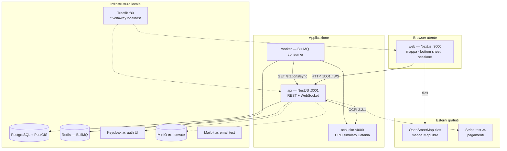

**Porte dirette (senza Traefik):** web `3000`, api `3001`, ocpi-sim `4000`.

---

## 2. Monorepo — chi chiama chi ✅

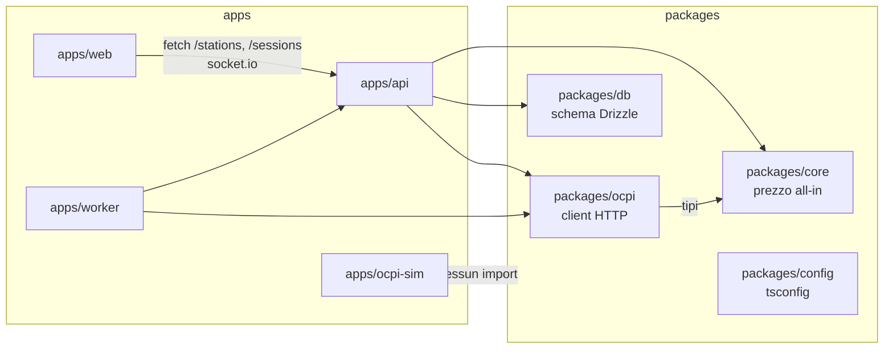

| Percorso | Ruolo |
|---|---|
| `apps/web/src/components/map/MapScreen.tsx` | Schermata principale — orchestrazione UI |
| `apps/web/src/lib/api.ts` | Client HTTP verso API |
| `apps/web/src/hooks/useSessionSocket.ts` | WebSocket aggiornamenti sessione |
| `apps/api/src/stations.controller.ts` | Lista colonnine + sync |
| `apps/api/src/sessions.service.ts` | Ciclo vita sessione |
| `apps/api/src/sessions.gateway.ts` | Emit Socket.IO |
| `apps/api/src/queue.service.ts` | Job ricorrente `availability.sync` |
| `apps/ocpi-sim/src/store.ts` | Dati fittizi Catania + sessioni |
| `packages/core/src/pricing/allInPrice.ts` | Motore €/kWh all-in |

---

## 3. Percorso utente (web) ✅

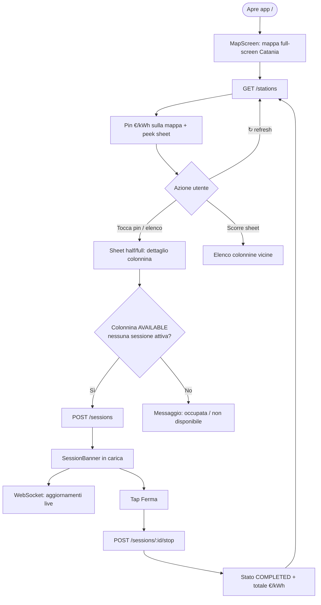

---

## 4. Flusso caricamento colonnine ✅

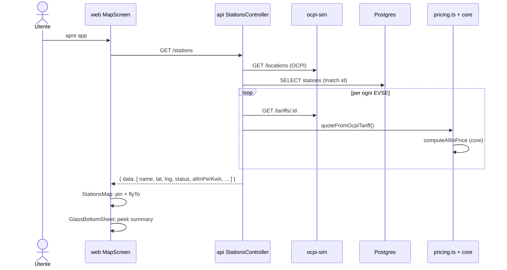

**File coinvolti:** `StationsMap.tsx`, `stations.controller.ts`, `pricing.ts`, `packages/ocpi/src/client.ts`.

---

## 5. Flusso avvio ricarica ✅

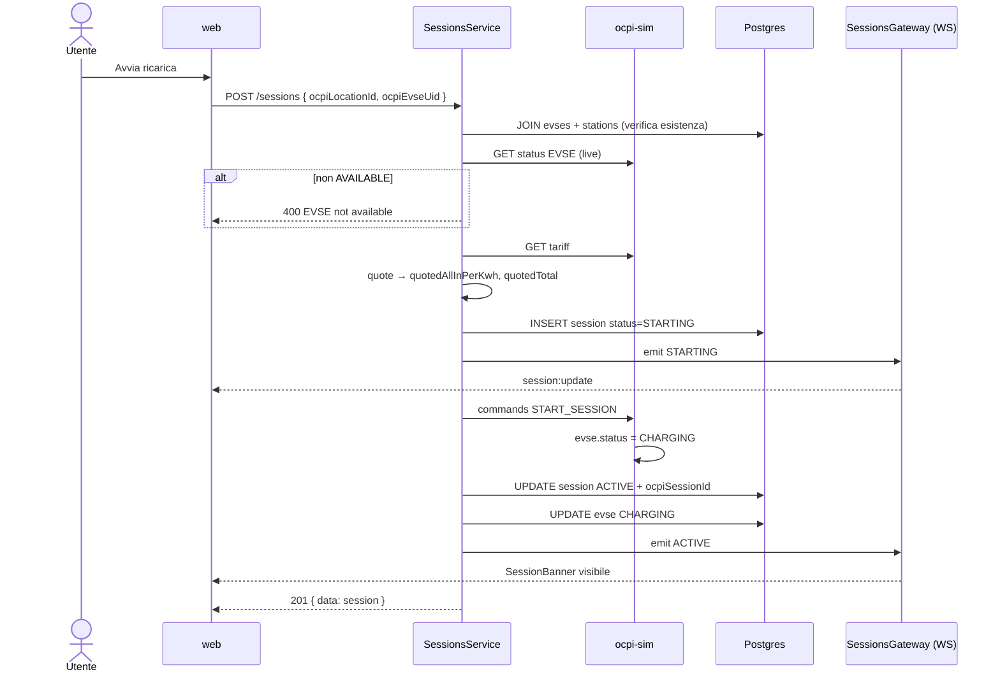

---

## 6. Flusso stop ricarica ✅

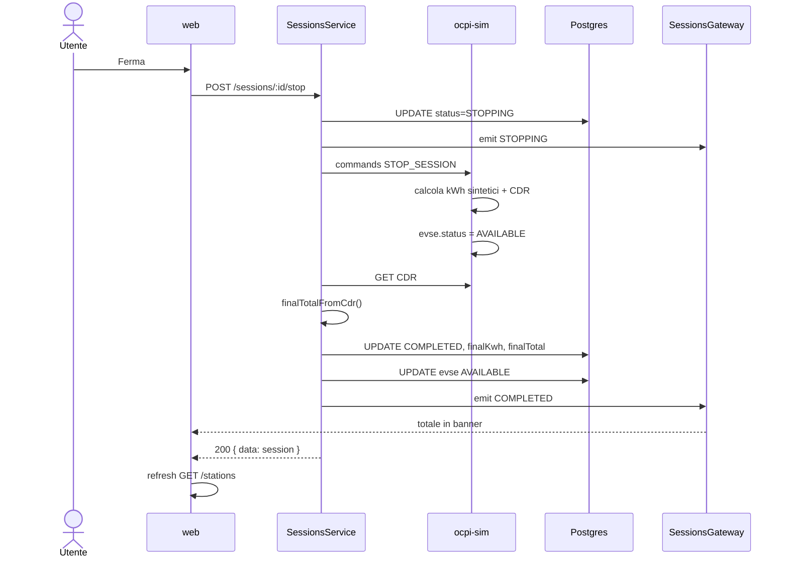

---

## 7. Macchina a stati sessione ✅

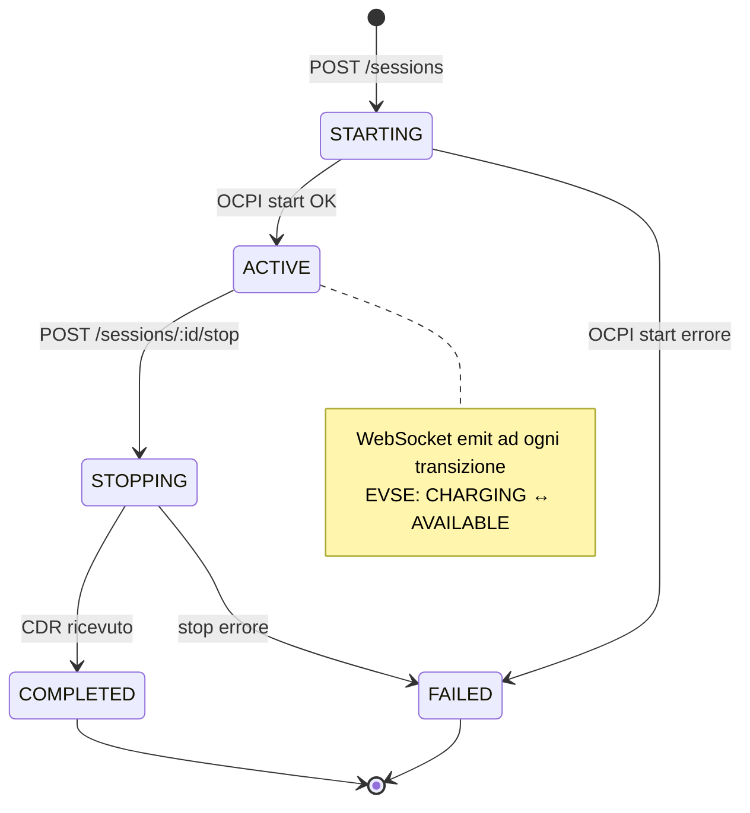

Definito in `packages/db/src/schema.ts` (`sessions.status`).

---

## 8. Realtime WebSocket ✅

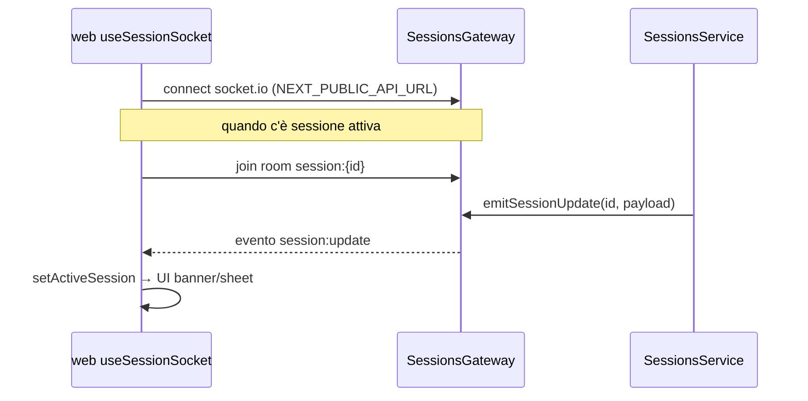

**Endpoint WS:** stesso host dell'API (`ws://localhost:3001` in locale).

---

## 9. Sync disponibilità (worker) ✅

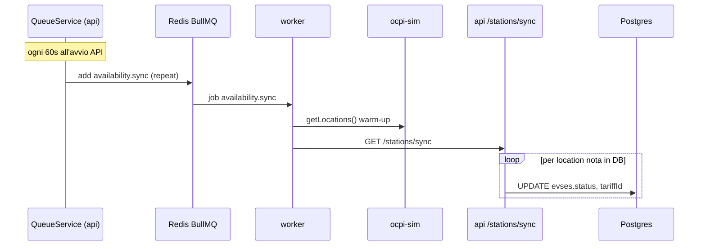

---

## 10. Dati Catania (ocpi-sim) ✅

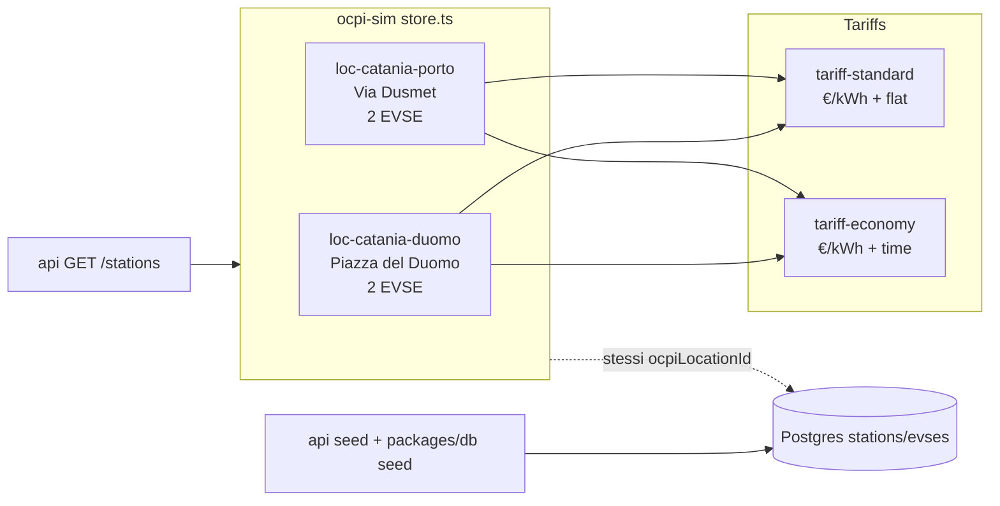

---

## 11. Flusso completo target (con pagamenti) 🔜

Stato **roadmap** — non ancora nel codice applicativo.

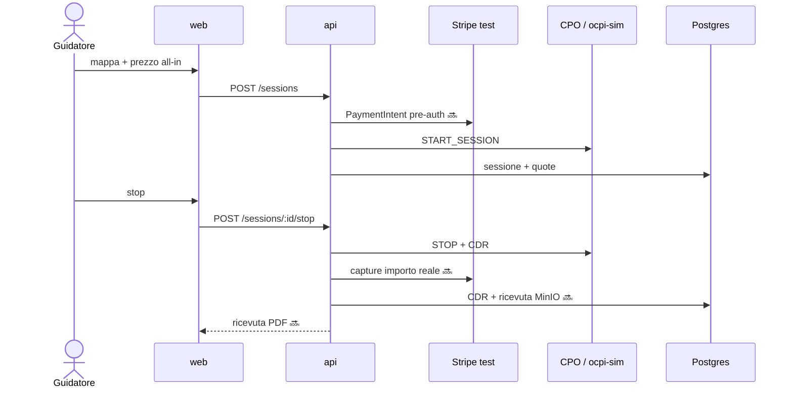

---

## 12. Avvio locale — sequenza dev ✅

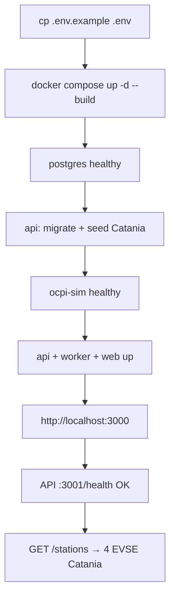

---

## Riferimento rapido endpoint API ✅

| Metodo | Path | Scopo |
|---|---|---|
| `GET` | `/health` | Healthcheck |
| `GET` | `/stations` | Colonnine + prezzo all-in (da OCPI) |
| `GET` | `/stations/sync` | Aggiorna status EVSE in DB da OCPI |
| `POST` | `/sessions` | Avvia ricarica |
| `POST` | `/sessions/:id/stop` | Termina e settlement CDR |
| `GET` | `/sessions/:id` | Dettaglio sessione |
| WS | `/sessions` namespace | `session:update` |

---

*Ultimo aggiornamento: allineato a `develop` con UI glass, colonnine Catania, commenti `@file` nel codice.*
